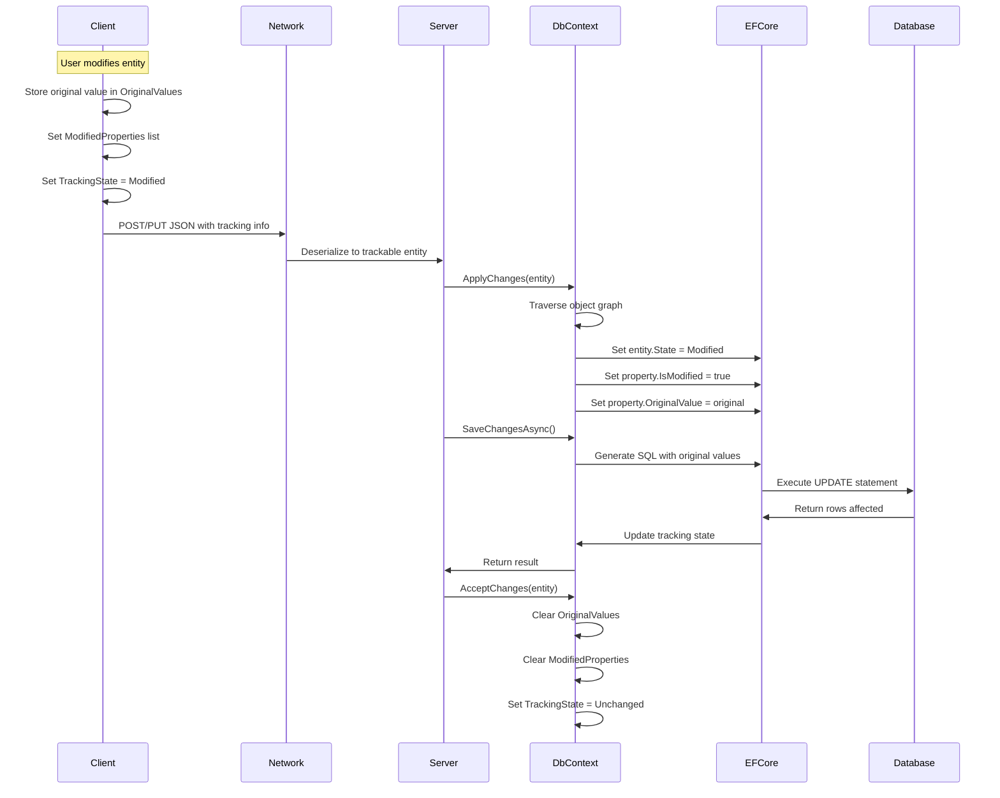
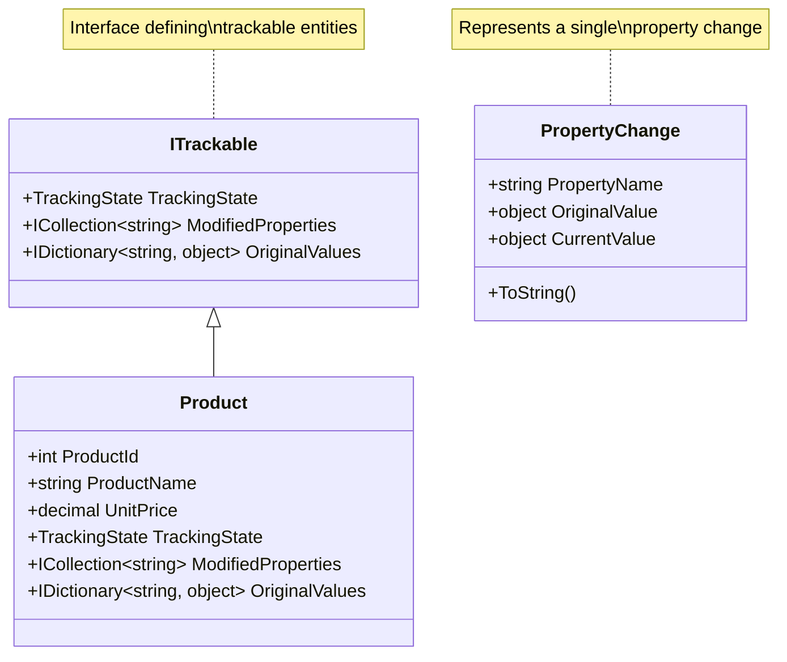

# Plan: Add Original Values Tracking to Trackable Entities

## Overview

This plan outlines the implementation of original values tracking for modified properties in the Trackable Entities library. This feature enables change comparison/diffing by storing the original values of properties before they were modified.

## Architecture Design

### 1. Interface Changes

#### 1.1 Update `ITrackable` Interface

**File**: [`TrackableEntities.Common.Core/ITrackable.cs`](TrackableEntities.Common.Core/ITrackable.cs)

Add a new property to store original values:

```csharp
public interface ITrackable
{
    TrackingState TrackingState { get; set; }
    ICollection<string> ModifiedProperties { get; set; }
    IDictionary<string, object> OriginalValues { get; set; }  // NEW
}
```

**Design Decisions**:
- **Type**: `IDictionary<string, object>` - Allows storing values of any type with property name as key
- **Null handling**: Property can be null (no original values tracked) or empty dictionary
- **Memory efficiency**: Only stores values for modified properties, not all properties

### 2. Core Library Changes

#### 2.1 Update `DbContextExtensions.SetEntityState` Method

**File**: [`TrackableEntities.EF.Core/DbContextExtensions.cs`](TrackableEntities.EF.Core/DbContextExtensions.cs)

Modify the private `SetEntityState` method to apply original values to EF Core's change tracker:

```csharp
private static void SetEntityState(EntityEntry entry, EntityState state, ITrackable trackable)
{
    entry.State = state;

    if (entry.State == EntityState.Modified && trackable.ModifiedProperties != null)
    {
        foreach (var property in entry.Properties)
        {
            var propertyName = property.Metadata.Name;
            var isModified = trackable.ModifiedProperties.Any(p =>
                string.Compare(p, propertyName, StringComparison.InvariantCultureIgnoreCase) == 0);
            
            property.IsModified = isModified;
            
            // Apply original value if available
            if (isModified && trackable.OriginalValues != null)
            {
                if (trackable.OriginalValues.TryGetValue(propertyName, out var originalValue))
                {
                    property.OriginalValue = originalValue;
                }
            }
        }
    }
}
```

#### 2.2 Update `AcceptChanges` Method

**File**: [`TrackableEntities.EF.Core/DbContextExtensions.cs`](TrackableEntities.EF.Core/DbContextExtensions.cs)

Clear original values when accepting changes:

```csharp
public static void AcceptChanges(this DbContext context, ITrackable item)
{
    context.TraverseGraph(item, n =>
    {
        if (n.Entry.Entity is ITrackable trackable)
        {
            if (trackable.TrackingState != TrackingState.Unchanged)
                trackable.TrackingState = TrackingState.Unchanged;
            if (trackable.ModifiedProperties?.Count > 0)
                trackable.ModifiedProperties.Clear();
            // Clear original values
            if (trackable.OriginalValues?.Count > 0)
                trackable.OriginalValues.Clear();
        }
    });
}
```

#### 2.3 Add Helper Extension Methods

**File**: [`TrackableEntities.EF.Core/TrackableExtensions.cs`](TrackableEntities.EF.Core/TrackableExtensions.cs)

Add helper methods for working with original values:

```csharp
public static class TrackableExtensions
{
    // Existing ToEntityState/ToTrackingState methods...
    
    /// <summary>
    /// Sets an original value for a modified property.
    /// </summary>
    public static void SetOriginalValue(this ITrackable trackable, string propertyName, object originalValue)
    {
        if (trackable.OriginalValues == null)
            trackable.OriginalValues = new Dictionary<string, object>();
        
        trackable.OriginalValues[propertyName] = originalValue;
    }
    
    /// <summary>
    /// Gets the original value for a property if it exists.
    /// </summary>
    public static bool GetOriginalValue<T>(this ITrackable trackable, string propertyName, out T value)
    {
        value = default;
        if (trackable.OriginalValues?.TryGetValue(propertyName, out var obj) == true)
        {
            value = (T)obj;
            return true;
        }
        return false;
    }
    
    /// <summary>
    /// Gets a change description showing old and new values.
    /// </summary>
    public static IDictionary<string, PropertyChange> GetPropertyChanges(this ITrackable trackable)
    {
        var changes = new Dictionary<string, PropertyChange>();
        if (trackable.ModifiedProperties == null) return changes;
        
        foreach (var propertyName in trackable.ModifiedProperties)
        {
            object originalValue = null;
            object currentValue = null;
            
            if (trackable.OriginalValues?.TryGetValue(propertyName, out originalValue) == true)
            {
                // Get current value via reflection
                var property = trackable.GetType().GetProperty(propertyName);
                if (property != null)
                    currentValue = property.GetValue(trackable);
            }
            
            changes[propertyName] = new PropertyChange
            {
                PropertyName = propertyName,
                OriginalValue = originalValue,
                CurrentValue = currentValue
            };
        }
        
        return changes;
    }
}

/// <summary>
/// Represents a property change with original and current values.
/// </summary>
public class PropertyChange
{
    public string PropertyName { get; set; }
    public object OriginalValue { get; set; }
    public object CurrentValue { get; set; }
    
    public override string ToString() => $"{PropertyName}: {OriginalValue} -> {CurrentValue}";
}
```

## Test Project Modifications

### 3. Update Test Entity Models

Add `OriginalValues` property to all test entities that implement `ITrackable`:

#### 3.1 Northwind Models

**Files to update**:
- [`TrackableEntities.EF.Core.Tests/NorthwindModels/Product.cs`](TrackableEntities.EF.Core.Tests/NorthwindModels/Product.cs)
- [`TrackableEntities.EF.Core.Tests/NorthwindModels/Category.cs`](TrackableEntities.EF.Core.Tests/NorthwindModels/Category.cs)
- [`TrackableEntities.EF.Core.Tests/NorthwindModels/Customer.cs`](TrackableEntities.EF.Core.Tests/NorthwindModels/Customer.cs)
- [`TrackableEntities.EF.Core.Tests/NorthwindModels/Order.cs`](TrackableEntities.EF.Core.Tests/NorthwindModels/Order.cs)
- [`TrackableEntities.EF.Core.Tests/NorthwindModels/OrderDetail.cs`](TrackableEntities.EF.Core.Tests/NorthwindModels/OrderDetail.cs)
- [`TrackableEntities.EF.Core.Tests/NorthwindModels/Employee.cs`](TrackableEntities.EF.Core.Tests/NorthwindModels/Employee.cs)
- [`TrackableEntities.EF.Core.Tests/NorthwindModels/Territory.cs`](TrackableEntities.EF.Core.Tests/NorthwindModels/Territory.cs)
- [`TrackableEntities.EF.Core.Tests/NorthwindModels/EmployeeTerritory.cs`](TrackableEntities.EF.Core.Tests/NorthwindModels/EmployeeTerritory.cs)
- [`TrackableEntities.EF.Core.Tests/NorthwindModels/Area.cs`](TrackableEntities.EF.Core.Tests/NorthwindModels/Area.cs)
- [`TrackableEntities.EF.Core.Tests/NorthwindModels/CustomerAddress.cs`](TrackableEntities.EF.Core.Tests/NorthwindModels/CustomerAddress.cs)
- [`TrackableEntities.EF.Core.Tests/NorthwindModels/CustomerSetting.cs`](TrackableEntities.EF.Core.Tests/NorthwindModels/CustomerSetting.cs)
- [`TrackableEntities.EF.Core.Tests/NorthwindModels/Promo.cs`](TrackableEntities.EF.Core.Tests/NorthwindModels/Promo.cs)
- [`TrackableEntities.EF.Core.Tests/NorthwindModels/HolidayPromo.cs`](TrackableEntities.EF.Core.Tests/NorthwindModels/HolidayPromo.cs)
- [`TrackableEntities.EF.Core.Tests/NorthwindModels/ProductInfo.cs`](TrackableEntities.EF.Core.Tests/NorthwindModels/ProductInfo.cs)

**Example modification** (Product.cs):
```csharp
public partial class Product : ITrackable
{
    // ... existing properties ...
    
    [NotMapped]
    public TrackingState TrackingState { get; set; }
    [NotMapped]
    public ICollection<string> ModifiedProperties { get; set; }
    [NotMapped]  // NEW
    public IDictionary<string, object> OriginalValues { get; set; }  // NEW
}
```

#### 3.2 Family Models

**Files to update**:
- [`TrackableEntities.EF.Core.Tests/FamilyModels/Parent.cs`](TrackableEntities.EF.Core.Tests/FamilyModels/Parent.cs)
- [`TrackableEntities.EF.Core.Tests/FamilyModels/Child.cs`](TrackableEntities.EF.Core.Tests/FamilyModels/Child.cs)

### 4. Add Unit Tests

#### 4.1 Single Entity Original Values Tests

**File**: [`TrackableEntities.EF.Core.Tests/NorthwindDbContextTests.cs`](TrackableEntities.EF.Core.Tests/NorthwindDbContextTests.cs)

```csharp
#region Original Values - Single Entity

[Fact]
public void Apply_Changes_With_OriginalValue_Sets_EF_OriginalValue()
{
    // Arrange
    var context = _fixture.GetContext();
    var product = new Product
    {
        ProductId = 1,
        UnitPrice = 10.00m,
        TrackingState = TrackingState.Modified,
        ModifiedProperties = new List<string> { nameof(Product.UnitPrice) },
        OriginalValues = new Dictionary<string, object> 
        { 
            { nameof(Product.UnitPrice), 5.00m } 
        }
    };

    // Act
    context.ApplyChanges(product);

    // Assert
    var priceProp = context.Entry(product).Property<decimal>(nameof(Product.UnitPrice));
    Assert.True(priceProp.IsModified);
    Assert.Equal(5.00m, priceProp.OriginalValue);  // Original value
    Assert.Equal(10.00m, priceProp.CurrentValue);  // Current value
}

[Fact]
public void Apply_Changes_With_Multiple_OriginalValues_Sets_All_EF_OriginalValues()
{
    // Arrange
    var context = _fixture.GetContext();
    var product = new Product
    {
        ProductId = 1,
        ProductName = "Updated Name",
        UnitPrice = 15.00m,
        TrackingState = TrackingState.Modified,
        ModifiedProperties = new List<string> 
        { 
            nameof(Product.ProductName), 
            nameof(Product.UnitPrice) 
        },
        OriginalValues = new Dictionary<string, object> 
        { 
            { nameof(Product.ProductName), "Original Name" },
            { nameof(Product.UnitPrice), 10.00m } 
        }
    };

    // Act
    context.ApplyChanges(product);

    // Assert
    var nameProp = context.Entry(product).Property<string>(nameof(Product.ProductName));
    var priceProp = context.Entry(product).Property<decimal>(nameof(Product.UnitPrice));
    
    Assert.True(nameProp.IsModified);
    Assert.Equal("Original Name", nameProp.OriginalValue);
    Assert.Equal("Updated Name", nameProp.CurrentValue);
    
    Assert.True(priceProp.IsModified);
    Assert.Equal(10.00m, priceProp.OriginalValue);
    Assert.Equal(15.00m, priceProp.CurrentValue);
}

[Fact]
public void Apply_Changes_Without_OriginalValue_Uses_Current_As_Original()
{
    // Arrange
    var context = _fixture.GetContext();
    var product = new Product
    {
        ProductId = 1,
        UnitPrice = 10.00m,
        TrackingState = TrackingState.Modified,
        ModifiedProperties = new List<string> { nameof(Product.UnitPrice) }
        // No OriginalValues provided
    };

    // Act
    context.ApplyChanges(product);

    // Assert
    var priceProp = context.Entry(product).Property<decimal>(nameof(Product.UnitPrice));
    Assert.True(priceProp.IsModified);
    // EF Core will use current value as original when not set
    Assert.Equal(10.00m, priceProp.CurrentValue);
}

[Fact]
public void AcceptChanges_Clears_OriginalValues()
{
    // Arrange
    var context = _fixture.GetContext();
    var product = new Product
    {
        ProductId = 1,
        UnitPrice = 10.00m,
        TrackingState = TrackingState.Modified,
        ModifiedProperties = new List<string> { nameof(Product.UnitPrice) },
        OriginalValues = new Dictionary<string, object> 
        { 
            { nameof(Product.UnitPrice), 5.00m } 
        }
    };

    // Act
    context.AcceptChanges(product);

    // Assert
    Assert.Equal(TrackingState.Unchanged, product.TrackingState);
    Assert.Empty(product.ModifiedProperties);
    Assert.Empty(product.OriginalValues);
}

#endregion
```

#### 4.2 Object Graph Original Values Tests

```csharp
#region Original Values - Object Graph

[Fact]
public void Apply_Changes_With_OriginalValues_On_ObjectGraph_Sets_All_OriginalValues()
{
    // Arrange
    var context = _fixture.GetContext();
    var order = new Order
    {
        OrderId = 1,
        Required = true,
        TrackingState = TrackingState.Modified,
        ModifiedProperties = new List<string> { nameof(Order.Required) },
        OriginalValues = new Dictionary<string, object> 
        { 
            { nameof(Order.Required), false } 
        },
        OrderDetails = new List<OrderDetail>
        {
            new OrderDetail
            {
                OrderDetailId = 1,
                Quantity = 10,
                TrackingState = TrackingState.Modified,
                ModifiedProperties = new List<string> { nameof(OrderDetail.Quantity) },
                OriginalValues = new Dictionary<string, object> 
                { 
                    { nameof(OrderDetail.Quantity), 5 } 
                }
            }
        }
    };

    // Act
    context.ApplyChanges(order);

    // Assert - Order
    var requiredProp = context.Entry(order).Property<bool>(nameof(Order.Required));
    Assert.True(requiredProp.IsModified);
    Assert.False(requiredProp.OriginalValue);
    Assert.True(requiredProp.CurrentValue);
    
    // Assert - OrderDetail
    var detailEntry = context.Entry(order).Collection("OrderDetails").EntityEntries.First();
    var quantityProp = detailEntry.Property<int>(nameof(OrderDetail.Quantity));
    Assert.True(quantityProp.IsModified);
    Assert.Equal(5, quantityProp.OriginalValue);
    Assert.Equal(10, quantityProp.CurrentValue);
}

[Fact]
public async Task Save_Changes_With_OriginalValues_Updates_With_Correct_Values()
{
    // Arrange
    var context = _fixture.GetContext();
    
    // First, add a product
    var originalProduct = await context.Products.FirstAsync();
    var originalPrice = originalProduct.UnitPrice;
    
    // Simulate client-side modification
    var trackableProduct = new Product
    {
        ProductId = originalProduct.ProductId,
        ProductName = originalProduct.ProductName,
        UnitPrice = originalPrice * 2,
        TrackingState = TrackingState.Modified,
        ModifiedProperties = new List<string> { nameof(Product.UnitPrice) },
        OriginalValues = new Dictionary<string, object> 
        { 
            { nameof(Product.UnitPrice), originalPrice } 
        }
    };

    // Act
    context.ApplyChanges(trackableProduct);
    await context.SaveChangesAsync();

    // Assert - Refresh from database
    var updatedProduct = await context.Products.FindAsync(originalProduct.ProductId);
    Assert.Equal(originalPrice * 2, updatedProduct.UnitPrice);
}

#endregion
```

#### 4.3 Helper Extension Method Tests

```csharp
#region Original Values - Helper Methods

[Fact]
public void SetOriginalValue_Adds_Value_To_Dictionary()
{
    // Arrange
    var product = new Product { ProductId = 1 };

    // Act
    product.SetOriginalValue(nameof(Product.UnitPrice), 10.00m);

    // Assert
    Assert.NotNull(product.OriginalValues);
    Assert.Contains(nameof(Product.UnitPrice), product.OriginalValues.Keys);
    Assert.Equal(10.00m, product.OriginalValues[nameof(Product.UnitPrice)]);
}

[Fact]
public void GetOriginalValue_Returns_Correct_Value()
{
    // Arrange
    var product = new Product
    {
        ProductId = 1,
        OriginalValues = new Dictionary<string, object> 
        { 
            { nameof(Product.UnitPrice), 10.00m } 
        }
    };

    // Act
    var result = product.GetOriginalValue<decimal>(nameof(Product.UnitPrice), out var value);

    // Assert
    Assert.True(result);
    Assert.Equal(10.00m, value);
}

[Fact]
public void GetPropertyChanges_Returns_All_Changes_With_Values()
{
    // Arrange
    var product = new Product
    {
        ProductId = 1,
        ProductName = "Updated Name",
        UnitPrice = 15.00m,
        TrackingState = TrackingState.Modified,
        ModifiedProperties = new List<string> 
        { 
            nameof(Product.ProductName), 
            nameof(Product.UnitPrice) 
        },
        OriginalValues = new Dictionary<string, object> 
        { 
            { nameof(Product.ProductName), "Original Name" },
            { nameof(Product.UnitPrice), 10.00m } 
        }
    };

    // Act
    var changes = product.GetPropertyChanges();

    // Assert
    Assert.Equal(2, changes.Count);
    
    var nameChange = changes[nameof(Product.ProductName)];
    Assert.Equal("Original Name", nameChange.OriginalValue);
    Assert.Equal("Updated Name", nameChange.CurrentValue);
    
    var priceChange = changes[nameof(Product.UnitPrice)];
    Assert.Equal(10.00m, priceChange.OriginalValue);
    Assert.Equal(15.00m, priceChange.CurrentValue);
}

#endregion
```

## Testing Phase

### 5. Test Execution Plan

#### Phase 1: Unit Tests (Isolated)

| Test Category | Test Files | Expected Outcome |
|---------------|------------|------------------|
| Original Values - Single Entity | NorthwindDbContextTests.cs | EF Core receives correct original values |
| Original Values - Object Graph | NorthwindDbContextTests.cs | Original values propagate through relationships |
| Helper Methods | TrackableExtensionsTests.cs (new) | Helper methods work correctly |

#### Phase 2: Integration Tests

| Test Category | Test Files | Expected Outcome |
|---------------|------------|------------------|
| Save with Original Values | NorthwindDbContextTests.cs | Database updated correctly |
| Concurrency Detection | NorthwindDbContextTests.cs | Conflicts detected when original values differ |

#### Phase 3: Backward Compatibility Tests

| Test Category | Test Files | Expected Outcome |
|---------------|------------|------------------|
| Existing Tests | All test files | All existing tests still pass |
| Null OriginalValues | NorthwindDbContextTests.cs | Works when OriginalValues is null |
| Empty OriginalValues | NorthwindDbContextTests.cs | Works when OriginalValues is empty |

### 6. Test Execution Commands

```bash
# Run all tests
dotnet test TrackableEntities.EF.Core.sln

# Run specific test category
dotnet test --filter "FullyQualifiedName~OriginalValue"

# Run with coverage
dotnet test --collect:"XPlat Code Coverage"
```

## Documentation Updates

### 7. Update README.md

**File**: [`README.md`](README.md)

Add section after the existing interface documentation:

```markdown
## Original Values Tracking

Trackable Entities supports storing the original values of modified properties, enabling change comparison and diffing functionality. This is particularly useful for:

- Showing users what changed before/after
- Audit logging and change tracking
- Optimistic concurrency control

### Setting Original Values

When modifying an entity on the client side, store the original value before making changes:

```csharp
// Before modifying
var originalPrice = product.UnitPrice;

// Modify the entity
product.UnitPrice = 10.00m;

// Set tracking state and original value
product.TrackingState = TrackingState.Modified;
product.ModifiedProperties = new List<string> { nameof(Product.UnitPrice) };
product.OriginalValues = new Dictionary<string, object> 
{ 
    { nameof(Product.UnitPrice), originalPrice } 
};
```

### Using Helper Methods

Trackable Entities provides helper methods for working with original values:

```csharp
// Set original value using helper
product.SetOriginalValue(nameof(Product.UnitPrice), 5.00m);

// Get original value
if (product.GetOriginalValue<decimal>(nameof(Product.UnitPrice), out var originalPrice))
{
    Console.WriteLine($"Original price was: {originalPrice}");
}

// Get all property changes
var changes = product.GetPropertyChanges();
foreach (var change in changes.Values)
{
    Console.WriteLine(change);  // Outputs: "UnitPrice: 5 -> 10"
}
```

### Server-Side Usage

On the server, EF Core automatically uses the original values for:

- Generating correct SQL UPDATE statements
- Optimistic concurrency detection
- Change tracking

```csharp
// Apply changes - EF Core receives original values automatically
_context.ApplyChanges(product);

// Check what changed before saving
var priceProperty = _context.Entry(product).Property<decimal>(nameof(Product.UnitPrice));
Console.WriteLine($"Changed from {priceProperty.OriginalValue} to {priceProperty.CurrentValue}");

// Save changes
await _context.SaveChangesAsync();
```
```

## Implementation Order

1. **Update ITrackable interface** - Add OriginalValues property
2. **Update test entity models** - Add OriginalValues to all test entities
3. **Update DbContextExtensions.SetEntityState** - Apply original values to EF Core
4. **Update AcceptChanges method** - Clear original values
5. **Add helper extension methods** - SetOriginalValue, GetOriginalValue, GetPropertyChanges
6. **Add unit tests** - Single entity, object graph, helper methods
7. **Add integration tests** - Save operations, concurrency
8. **Run all tests** - Verify backward compatibility
9. **Update documentation** - README.md with examples

## Mermaid Diagram: Original Values Flow



## Mermaid Diagram: Class Structure



## Summary

This plan adds original values tracking to Trackable Entities by:

1. Adding an `OriginalValues` dictionary property to the `ITrackable` interface
2. Modifying `DbContextExtensions.SetEntityState` to apply original values to EF Core's change tracker
3. Updating `AcceptChanges` to clear original values after saving
4. Providing helper extension methods for easy manipulation
5. Adding comprehensive unit and integration tests
6. Updating documentation with usage examples

The implementation is backward compatible - existing code continues to work without modification, and the new feature is opt-in by populating the `OriginalValues` dictionary.
